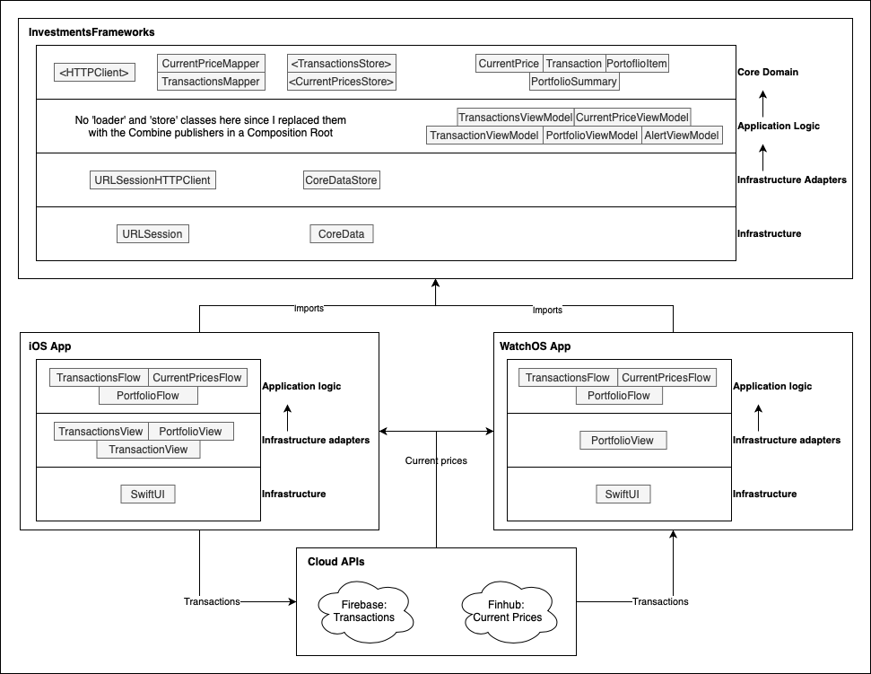

# Investments

[](https://github.com/litvakle/Investments/actions/workflows/CI.yml)

## About

The app's purpose is to have an instrument for real-time monitoring of the profit of user investments portfolio. Just open the app and see the answer! 

I used the TDD approach (write a test - write code - refactor). The workspace consists of three projects:
- Investments frameworks (platform-agnostic, runs on macOS, iOS, and watchOS)
- Investments App for iOS (platform-specific, runs on iOS)
- Investments App for watchOS (platform-specific, runs on watchOS)
Frameworks know nothing about the app—apps import frameworks for the desired functionality.

The app propagates the Dependency Injection principle, and the central part is a Composition Root (classes UIComposer for iOS and watchOS apps). All operations with loading/saving/deleting transactions and loading/caching current prices are implemented with the Combine. It allows us to use any infrastructure under the Combine publishers. For example, the iOS app loads transactions from the CoreDataStore, which works sync, and watchOS app loads transactions async from the remote API. All we need to do is to make different load publishers for iOS and watchOS and inject them into a TransactionsViewModel. And since Apple already tests Combine, we don't need to write unit tests for publishers. We should make only high-level acceptance tests. Without Combine, we would have to make decorator/adapter classes and write unit tests for them. Besides that, Combine is also used to maintain subscriptions between different app states. 

For the UI, I used the SwiftUI framework and the ViewInspector to make tests for SwiftUI views. 

I used FinHub API (https://finnhub.io/docs/api/authentication) for retrieving current stock prices and Firebase (with REST API) to store transactions. 

## App Architecture



## BDD Specs

### Story: Transactions list

#### Narrative

```
As a user of the App
I want to store information about my transactions
So I can see all my transactions in the App
```

##### Scenarios (acceptance criteria)

```
Given the user with stored transactions
When the user enters 'Transactions'
He sees a list of stored transactions
```

```
Given the user editing a stored transaction
When he saves it
He sees the transaction in a stored transactions
```

```
Given the user removing a stored transaction
When he removes it
He doesn't see the transaction in a stored transactions
```

#### Use cases

##### Display Transactions

```
Data:

Primary course (happy path)
1. Execute "RetrieveTransactions" command
2. System encodes stored Transactions
3. System uploads transactions to a Remote transactions storage
4. System delivers successful result

Storage retrival error (sad path)
1. System delivers retrival error
```

##### Delete Transaction

```
Data:
- Transaction (id)

Primary course (happy path)
1. Execute "DeleteTransaction" command with above Data
2. System encodes Transaction to a stored
3. System removes a stored transaction
4. System delivers successful result

Storage removal error (sad path)
1. System delivers removal error
```

### Story: Add new transaction

#### Narrative

```
As a user of the App
I want to ba able to add new transactions
So I can store all new transactions in the app
```

##### Scenarios (acceptance criteria)

```
Given the user adding a new transaction
When the user enters 'Quantity' and 'Sum'
The system calculates 'Price'
```

```
Given the user adding a new transaction
When the user tap 'Save'
The system checks the correcthness of all fields
```

```
Given the user adding a new transaction
When the user tap 'Save' and system validates all the fields
The system does not save transaction unitl all fields are correct
```

```
Given the user adding a new transaction
When he saves it
He sees the transaction in a stored transactions
```

```
Given the user adding a new transaction
When he cancels it
He doesn't see the transaction in a stored transactions
```

#### Use cases

##### Save Transaction

```
Data:
- Date
- Type
- Ticket
- Quantity
- Price
- Sum

Primary course (happy path)
1. Execute "SaveTransaction" command with above Data
2. System validates fields
- Ticket - 3 or 4 letters
- Quantity > 0
- Sum > 0
3. System delivers successful result

Storage saving error (sad path)
1. System delivers error for each of velidating fields
```

### Story: Portfolio

#### Narrative

```
As a user of the App
I want to see summary information about my portfolio
So I can simply understand my profit or loss
```

##### Scenarios (acceptance criteria)

```
Given the user with no transactions
When the user opens 'Portfolio'
He sees an empty view
```

```
Given the user with stored transactions
When the user enters 'Portflio'
He sees a tickets list with total current cost, profit and detailed data for each ticket
```

```
Given the user with stored transactions
When the user saves new transaction and enters 'Portflio'
He sees an updated portfolio
```

#### Use cases

##### Display portfolio

```
Data:

Primary course (happy path)
1. Retrieve transactions from storage
2. Get current prices fot tickets
3. Calculate portoflio items and portfolio summary
4. System delivers successful result

Storage retrival error (sad path)
1. System delivers retrival error

Current prices retrival error (sad path)
1. System delivers current prices retrieval error
```

### Story: Current prices

#### Narrative

```
As a user of the App
I want to see current prices of my items
So then I can see total cost of my profile and calc profit
```

##### Scenarios (acceptance criteria)

```
Given the user with internet connection
When the user opens 'Portfolio'
The system loads current prices via the Internet
```

```
Given the user without internet connection
When the user opens 'Portfolio'
The system loads current prices from the cache
```

#### Use cases

##### Load current prices from remote

```
Data:
- Ticket

Primary course (happy path)
1. Retrieve data from the API
2. Decode retrieved to a CurrentPrice model
3. Save retrieved prices to cache
4. System delivers successful result

API connection error (sad path)
1. System delivers connection error

API invalid data error (sad path)
1. System delivers invalid data error
```

##### Load current prices from Cache

```
Data:
- Ticket

Primary course (happy path)
1. Retrieve data from the Cache
2. Decode retrieved to a CurrentPrice model
3. System delivers successful result

Cache retrieval error (sad path)
1. System delivers cache error
```

### Story: Portfolio (for WatchOS)

#### Narrative

```
As a user of the App
I want to see current cost and profit of my portfolio
So I can simply understand my profit or loss without using my iPhone
```

##### Scenarios (acceptance criteria)

```
Given the user with no transactions
When the user launches the app
He sees an view with zero cost and profit
```

```
Given the user with stored transactions
When the user launches the app
He sees a total current cost of his investments and his profit
```

#### Use cases

##### Display portfolio

```
Data:

Primary course (happy path)
1. Retrieve transactions from remote storage
2. Get current prices fot tickets
3. Calculate portfolio summary
4. System delivers successful result

Remote storage retrival error (sad path)
1. System delivers retrival error

Current prices retrival error (sad path)
1. System delivers current prices retrieval error
```
